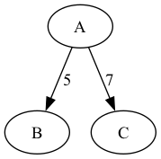
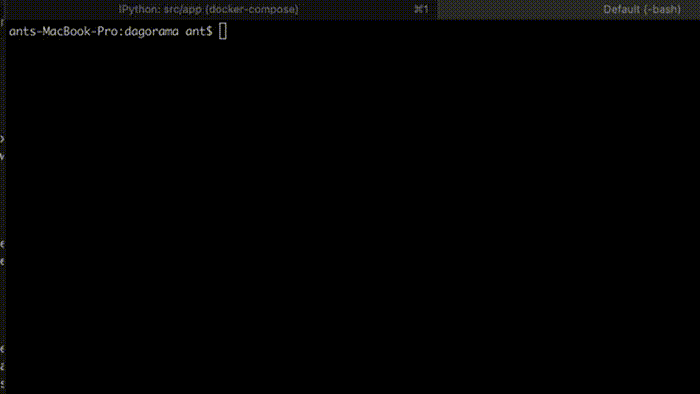

# DAGorama
Write a workflow runner that can accept the specification of a workflow in the form of a DAG
represented in JSON where letters are assigned to the vertices and numbers are assigned to
the edges. One node will be designated as the start vertex.
As the runner goes through the graph it should print the letter of each vertex it visits. Next, for
each edge ei going out of a vertex wait ti seconds before traveling to the connected vertex where
t is the number that is tied to edge ei.



Note: The runner should process edges in parallel so that it starts the “timer” for each edge
going out of a vertex at the same time after printing the vertex letter. For example, consider the
graph where A is the start vertex:

## Approach

* First model the data using python classes since this would make the application code simpler to read and debug.  It also allows us to tie node state with workflow running so that we can track what nodes were actually getting processed (See `Node.run_count`). Specialized Exception classes help identify error conditions that could arise while parsing input.
* Python's `threading` module helps simulate the DAG running.
* Test cases are included to exercise the parsing and processing code using `pytest`
* A supplemental visualization feature was included to make it easier to understand/validate the DAGs
* Project Layout - A fairly conventional python project arrangement was chosen. Source code is partitioned by concerns in a simple package layout.  Typical build tools are employed like poetry, docker, and `make`:
```
├── Dockerfile 
├── Makefile   # Supports local or Docker driven install
├── README.md
├── app
│   ├── __init__.py
│   ├── io.py  # File parsing, graph rendering
│   ├── model.py  # Node, Edge, Graph data models
│   └── workflow_runnner.py # The application code (accesssed by main.py)
├── docker-compose.yml
├── docs
├── install.sh
├── main.py  # Command line entrypoint into the system for running the workflows
├── output # where output is dumped.  for now, it's just .pngs generated via graphviz
├── pyproject.toml
└── tests  # test cases using pytest
```
## Installation, running
The  workflow runner is run in `app.workflow_runner.run_workflows()`.
There are 2 ways to install this project and invoke the runner
### Locally
For systems set up for development already having `python3` and `make` build tools.  This is driven by a minimally configured `Makefile` that will build a VE in `./venv`.  This was handy for me to quickly get going.
```bash
make test-local;
make run-local; # runs the app/workflow_runner.py
make viz-local; # provided you installed graphviz on your system already, creates .png graphs in ./output from tests/data/*json
make clean # removes all installed goods
```
### Docker
For systems having a docker service installed and runnning.  While Docker sounds like overkill for this exercise, I do think it's helpful to have productionized deployment in mind from the start of a new project. It eases collaboration among devs and enables CI/CD
```bash
docker-compose up tests --build  # Builds the appliation and runs tests defined in ./tests
docker-compose up app --build  # Builds the appliation and runs app/workflow_runner.py
docker-compose up viz --build  # Builds the appliation and creates .png graphs in ./output from tests/data/*json

```
## And if nothing else, watch it run on my system (-:



